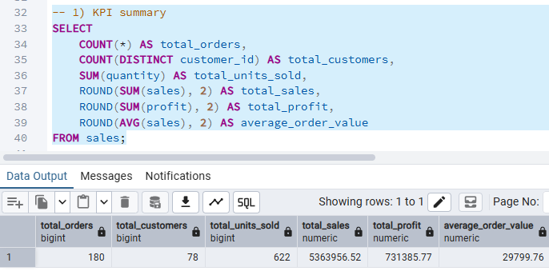
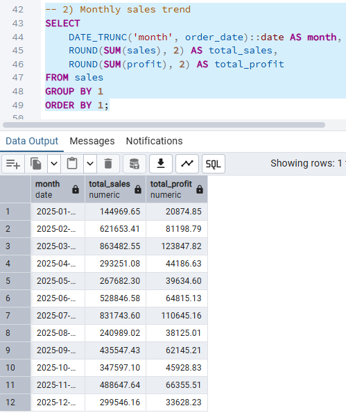
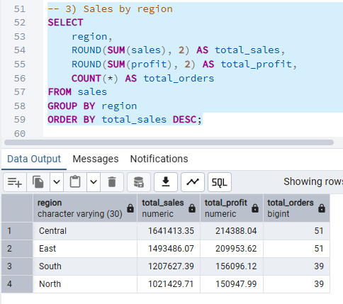
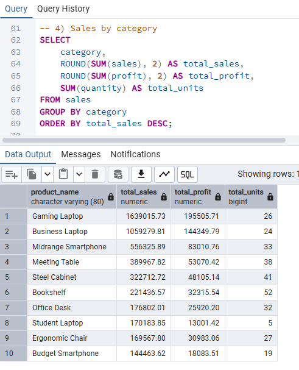
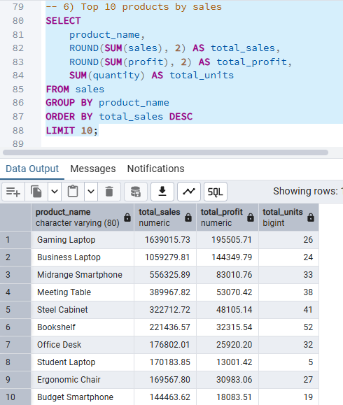

# SQL Business Insights Dashboard

## Overview
This project demonstrates a simple business insights workflow using PostgreSQL and SQL. A structured sales dataset was imported into a PostgreSQL database, then queried to generate KPI summaries, monthly sales trends, regional performance analysis, category-level insights, and top-selling products.

## Tools Used
- PostgreSQL
- pgAdmin 4
- SQL
- GitHub

## Dataset Scope
The dataset contains sales transaction records with fields such as:
- order_id
- order_date
- customer_id
- region
- city
- category
- sub_category
- product_name
- quantity
- sales
- profit

## Key SQL Questions Answered
1. What are the overall KPI totals for orders, customers, units sold, sales, and profit?
2. How do sales and profit perform month by month?
3. Which region generates the highest sales and profit?
4. Which product categories perform best?
5. What are the top 10 products by total sales?

## Query Highlights
The project includes SQL queries for:
- KPI summary
- Monthly sales trend
- Sales by region
- Sales by category
- Top 10 products by sales
- Profit margin analysis

## Key Results
- Total orders: **180**
- Total customers: **78**
- Total units sold: **622**
- Total sales: **5,363,956.52**
- Total profit: **731,385.77**
- Average order value: **29,799.76**

## Insights
- The **Central** region recorded the highest total sales at **1,641,413.35** and the highest profit at **214,388.04**.
- Monthly sales peaked in **March 2025** at **863,482.55**, followed by **July 2025** at **831,743.60**.
- The top-selling product was **Gaming Laptop** with **1,639,015.73** in total sales, followed by **Business Laptop** with **1,059,279.81**.

## Screenshots
### KPI Summary

### Monthly Sales Trend

### Sales by Region

### Sales by Category

### Top 10 Products by Sales

## Files Included
- `sales_data_sample.csv`
- `sql_business_insights_queries.sql`

## Resume-Ready Description
Designed a mini analytics workflow using PostgreSQL and SQL to import, query, summarize, and analyze structured sales data for reporting and decision support.
